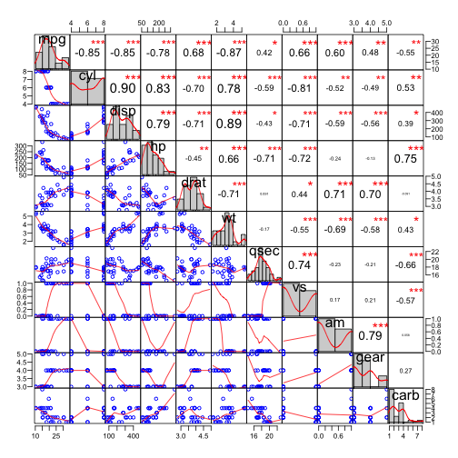

## Regression Model Analyser

 
#### An app to help you build linear regression models
 
* Developed to automate the process of creating linear regression models.
* Analysis is done in R language without having to know any programming.
* Each step in the regression modelling can be accessed by simple tab toggles.
 

#### App Features in Tabs

* Selection of data sets (including data set uploaded by user)
* The Correlation Matrix Plot
* Model Summary
* Diagnostic Plots
* Visualization of the raw data

http://fredus.shinyapps.io/RegApp

--- &twocol w1:30% w2:70%

## Correlation Matrix Plot

 

*** =left
 
* Uses package ``PerformanceAnalytics``.
* Helps identify the most relevant variables.
* Scatter plots of all variable combinations.
* Distribution histograms of all variables.
* Correlation coefficients with respective significance indicator (font size and stars).
* Help the identification collinearity of regressors/predictors.
 
 
 
http://fredus.shinyapps.io/RegApp

*** =right
 

--- &twocol w1:20% w2:80%

## Model Summary

 
 
 

*** =left

- Select the data set
- Select the desired outcome variable 
- Select the desired predictor variables
- Toggle to the ``Model Summary`` tab to see details such as residuals and coefficients summaries.

 
 
 
http://fredus.shinyapps.io/RegApp

*** =right

--- &twocol w1:20% w2:80%

## Diagnostic Plots

*** =left

 
 

- Toggle to ``Diagnostic Plots`` tab.
- These plots help to assess the fit of the model generated as well as the patern of residuals (normality, scedastcity, influential points, etc). 

 
 
``Thank you`` for assessing the app. 
 
Hope it will be as useful as was fun to make it!

 
http://fredus.shinyapps.io/RegApp

*** =right

 

